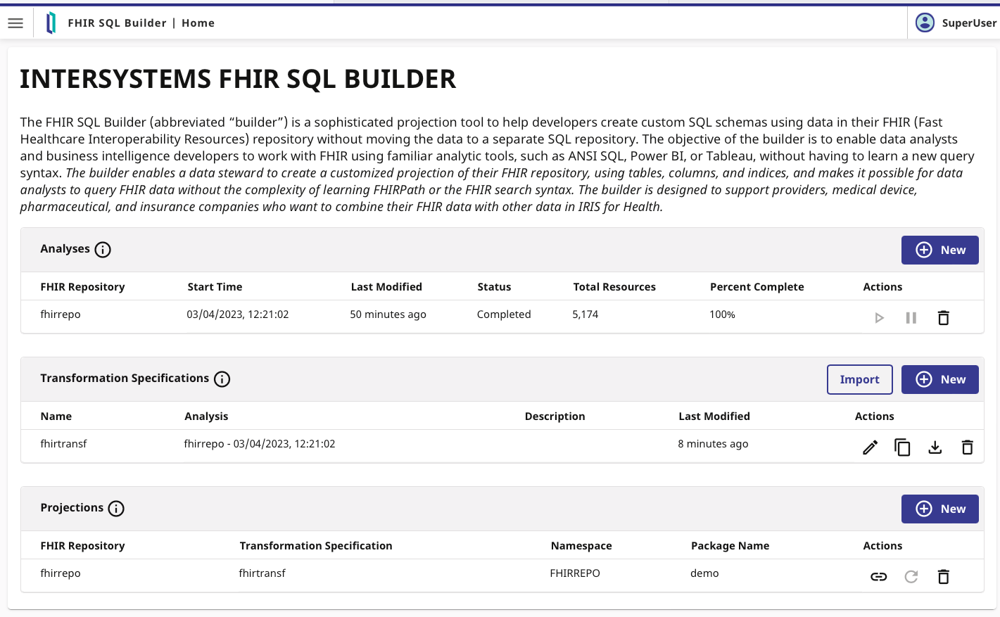

# Workshop: Intro to Healthcare Interoperability
This repository contains a set of hands-on examples of healthcare integrations to help you understand **InterSystems IRIS for Health Interoperability Framework**.

> For more in-depth learning resources, visit [InterSystems Learning](https://learning.intersystems.com).

> If you are interested in diagnostic image interoperability, visit [workshop-iris-dicom-interop](https://github.com/intersystems-ib/workshop-iris-dicom-interop)

# Requirements

To run this workshop, please make sure you have the following installed:

- [Git](https://git-scm.com/downloads)  
- [Docker](https://www.docker.com/products/docker-desktop) and [Docker Compose](https://docs.docker.com/compose/install/) - ⚠️ On Windows, ensure Docker is set to use **Linux containers**.  
- [Visual Studio Code](https://code.visualstudio.com/download) with [InterSystems ObjectScript Extension Pack](https://marketplace.visualstudio.com/items?itemName=intersystems-community.objectscript-pack)

---

# Setup

Clone the repository and start the project using Docker Compose:

```bash
git clone https://github.com/intersystems-ib/workshop-healthcare-interop
cd workshop-healthcare-interop
docker compose build
docker compose up -d
```

Then, open the `workshop-healthcare-interop` folder in **VS Code**.

---

# Hands-on 

## 1. HIS sends an order to Lab and Lab sends back results

### HIS creates order to LAB


In this scenario: a HIS sends an order to IRIS using custom REST message, IRIS will validate the test using the Laboratory catalog through SQL (external database) and then will transform it into a ORM^O01 HL7 message that will be sent to Lab.

* Open the [Management Portal](http://localhost:52773/csp/sys/UtilHome.csp).
* Login using the default `superuser`/ `SYS` account.
* Open [Demo.OrderProduction](http://localhost:52773/csp/healthshare/interop/EnsPortal.ProductionConfig.zen?PRODUCTION=Demo.OrderProduction). This production contains all the components we need to run this scenario.
* Have a look at the Business Services, Business Processes and Business Operations. Those components are responsible for input data, process it and output to other systems. Check the different settings available for each component. 
* Click on the *connector* (green ball) to see how the components are linked.
* See the *Legend* to understand the meaning of the different colors of the components.

#### Test LAB Catalog SQL Business Operation

* Click on `LAB Catalog SQL` component to test it independently. So you can check if a test code is available.
* This component will actually run a query in an external SQL as part of the integration.
* Go to *Actions* tab > Test > Choose a `Demo.LAB.Msg.CheckTestCatalogReq` message.
* Enter some a test code like `GLU` or `CBC` and see the output in the resulting Visual Trace.
* Have a look at the involved Business Operation and Messages in VS Code.

If you are curious, you can connect to the external MySQL and run the query:

```bash
docker exec -it mysql bash
mysql --host=localhost --user=testuser testdb -p  # Password: testpassword
```

Query example:

```sql
select * from TestCatalog;
```

#### Create a new order from HIS

* You can create a new order from HIS using Postman (check the included collection in [workshop-healthcare-interop.postman_collection](workshop-healthcare-interop.postman_collection.json))
* Or you can simply use `curl`:
```bash
curl -X POST http://localhost:52773/his/api/order \
  -H "Content-Type: application/json" \
  -d '{
  "msgId": "DDJ-20250408-001",
  "orderId": "ORD-20250408-001",
  "patient": {
    "mrn": "PAT-12345",
    "name": "Juan Perez",
    "birthDate": "1980-05-15",
    "gender": "male"
  },
  "practitioner": {
    "identifier": "DR-98765",
    "name": "Dr. Maria Gomez"
  },
  "orderDateTime": "2025-04-08T10:30:00Z",
  "test": {
      "code": "GLU",
      "description": "Blood glucose test",
      "priority": "routine"
   },
  "clinicalInfo": "Patient with dizziness and history of diabetes."
}'
```

* Open http://localhost:52773/csp/healthshare/interop/DemoLoanForm.csp and enter some data (you can test with different values).
* Go back to your production and open the [Message Viewer](http://localhost:52773/csp/healthshare/interop/EnsPortal.MessageViewer.zen).
* Have a look at the messages, go through some of the traces.
* Pay attention to the elements involved and the flow of the data in your integration.

#### Inspect HIS Order Process definition
* As you can see in the Visual Trace, `HIS Order Process` is the main process in the flow that coordinates calls to LAB Catalog and also builds the HL7 message that will be sent to Laboratory.
* Back in [Demo.OrderProduction](http://localhost:52773/csp/healthshare/interop/EnsPortal.ProductionConfig.zen?PRODUCTION=Demo.OrderProduction), click on `HIS Order Process`.
* On the settings tab, click on the magnifyer icon on the *Class name* setting.
* Inspect the graphical BPL definition of the process.


* In this same process definition, check any *Transform* action. Click on *DTL Editor* to access the Data Transformation definition


### LAB sends back results

#### Send a ORU^R01 result from LAB
* In your VS Code with `workshop-healthcare-interop` opened, copy `test/ORUR01_*` files into `test/in` subdirectory. This will simulate that the Laboratory is sending results back to HIS.
* Go back to the production and see [Message Viewer](http://localhost:52773/csp/healthshare/interop/EnsPortal.MessageViewer.zen).
* Explore some the new messages that have appeared. Notice the HL7 messages and the flow of data.

#### Explore Laboratory HL7 Routing Rules
* Click on `LAB HL7 Router In` component. This component receives all incoming HL7 from Laboratory and decide where it will be processed within the production.
* Click on the magnifying glass on *Business Rule Name* in the Settings Tab to check the actual rules that are being applied.


# FHIR Repository

In this scenario, we are going to create a FHIR repository in InterSystems IRIS For Health so we can persist FHIR resources and use the included API. So, for instance we will be able to create, search, update and delete [resources](https://hl7.org/fhir/R4/resourcelist.html) such as Patients, Observations, etc.

## Create FHIR endpoint
Create FHIR server in Health > FHIRREPO > FHIR Configuration > Server Configuration as:
* Namespace: `FHIRREPO`
* Name: `fhirrepo`
* URL: `/csp/healthshare/fhirrepo/fhir/r4`
* FHIR Version `FHIR R4`


This will take some time, depending on your machine resources.

## Load simple FHIR data

Now, let's add some sample FHIR data to populate our repository using [WebTerminal](http://localhost:52773/terminal/).

```objectscript
zn "FHIRREPO"
set sc = ##class(HS.FHIRServer.Tools.DataLoader).SubmitResourceFiles("/app/install/simple-fhir-data/","FHIRServer","/csp/healthshare/fhirrepo/fhir/r4")
```

After that, you will have a populated FHIR repository where you can try some interactions.


## Use your FHIR APIs
Now you can test the FHIR repository using FHIR interactions through the APIs.

You can use the included Postman collection in [workshop-healthcare-interop.postman_collection.json](./workshop-healthcare-interop.postman_collection.json).


Or you can also invoke programatically this APIs using the clients in Objectscript, for instance:
```objectscript
set clientObj = ##class(HS.FHIRServer.RestClient.FHIRService).CreateInstance("/csp/healthshare/fhirrepo/fhir/r4")
do clientObj.SetResponseFormat("JSON")
set response = clientObj.Read("GET", "Patient", "10")
zwrite response.Json
zwrite response.Json
```

# FHIR Interoperability

Let's say that you want to use the interoperability framework to manipulate the requests before or after it reaches the actual FHIR repository.

You can set up your repository to process all incoming requests using a Business Service.

To try that:
1-Open the [FHIR Server Management](http://localhost:52773/csp/fhir-management/index.html#/home) and edit your FHIR server.
2-Then, in the *FHIR Server Service Configuration* section:
* Service Config Name: `InteropService`. This will set this Business Service in the [fhirdemo.Production](http://localhost:52773/csp/healthshare/fhirrepo/EnsPortal.ProductionConfig.zen?PRODUCTION=fhirdemo.Production) to process all incoming requests.

So now, run again some FHIR requests and check the [Messages](http://localhost:52773/csp/healthshare/fhirrepo/EnsPortal.MessageViewer.zen) in the [fhirdemo.Production](http://localhost:52773/csp/healthshare/fhirrepo/EnsPortal.ProductionConfig.zen?PRODUCTION=fhirdemo.Production).

# FHIR Analytics: FHIR SQL Builder

What about running analytics on top of a FHIR repository? Well, FHIR model is a directed graph, so it's not trivial.

However, you can have a look at a new experimental feature: **InterSystems FHIR SQL Builder**.

FHIR SQL Builder is a tool that allows you to create your SQL schemas using data from your FHIR repository without moving the data to a separate SQL repository.



You will need to go through three simple steps:

## Analyze your FHIR repository data
Access [FHIR SQL Builder](http://localhost:52773/csp/fhirsql/index.html#/) and create a **New Analysis**:
* New FHIR repository
* Name: `fhirrepo`
* Host: `localhost`
* Port: `52773`
* Credentials: create new credentials using `superuser` / `SYS`
* FHIR repository endpoint: `/csp/healthshare/fhirrepo/fhir/r4`

## Choose data you want to project to SQL
Create a **New Transformation Specification**.

Add some FHIR fields that will be projected as SQL, you can try the following:
* `Patient.gender`
* `Observation.code.coding.code`
* `Observation.valueQuantity.value`


Or you can just import the transformation defined in [fhirtransf.json](install/fhirtransf.json).

## Project data to SQL
Simply create a **New Projection** specifying the package you want to use for your projection (e.g. `demo`).

After that, you can access your data using SQL!

In your workshop you have included a [JupyterLab Notebook](http://localhost:8888/lab/tree/IRISPython.ipynb) to play with the data :)


