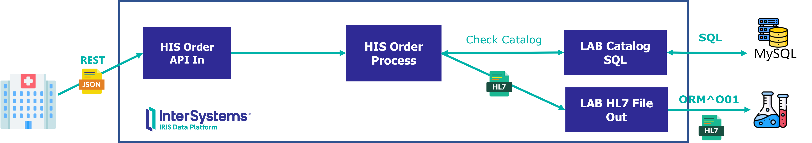
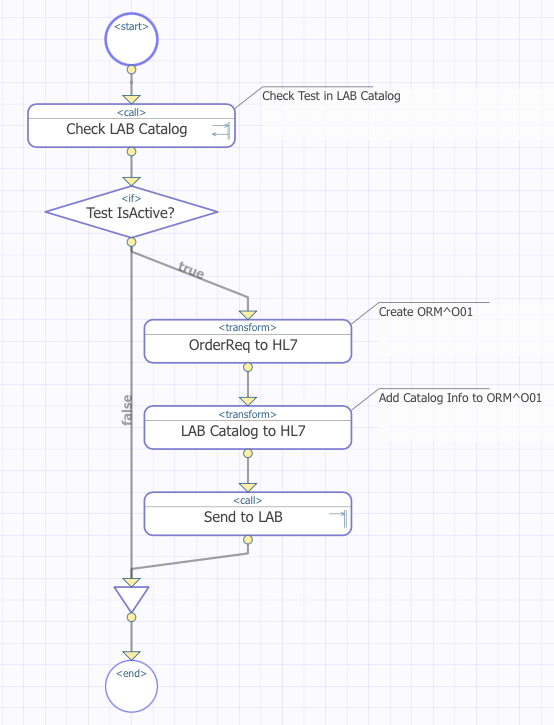
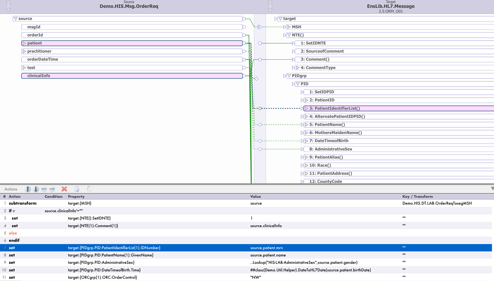
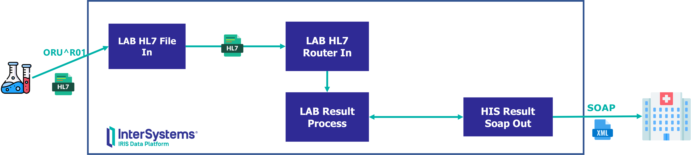
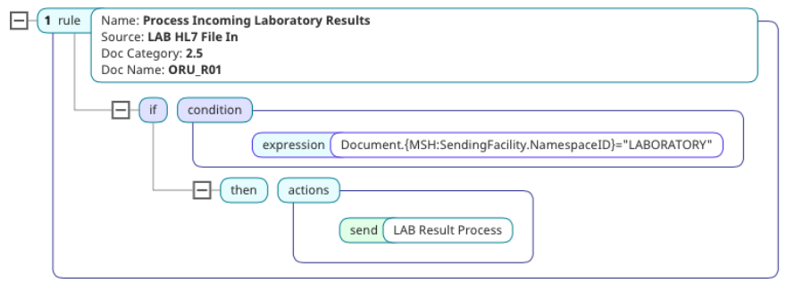
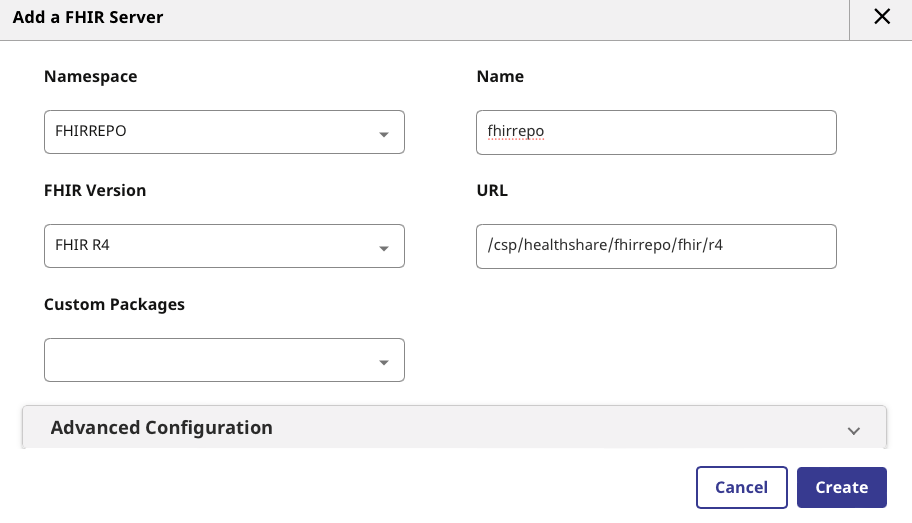
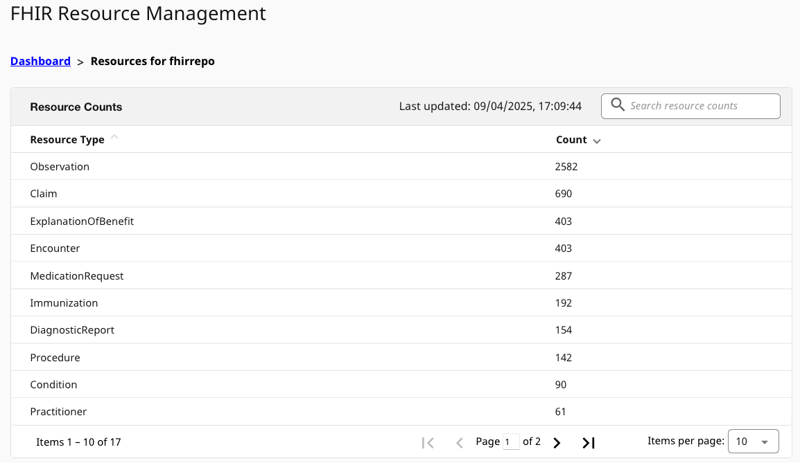
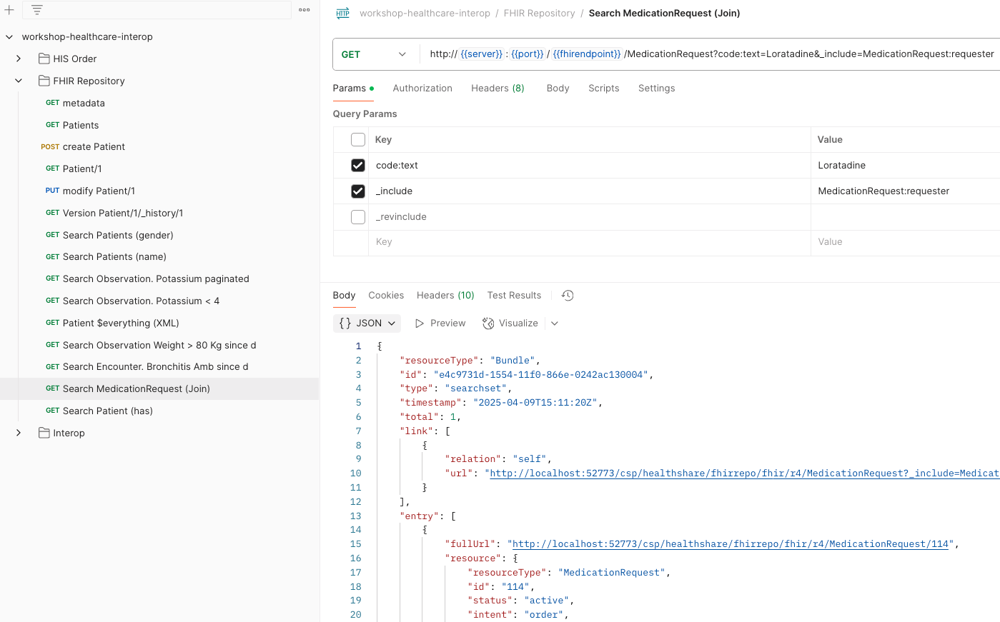
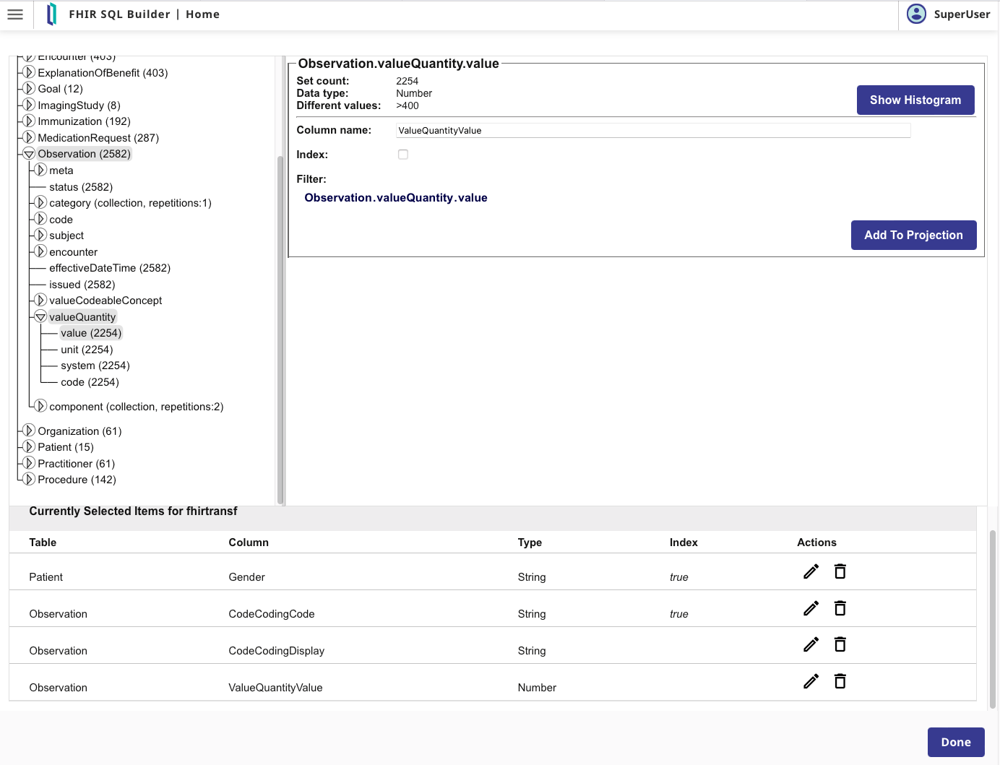
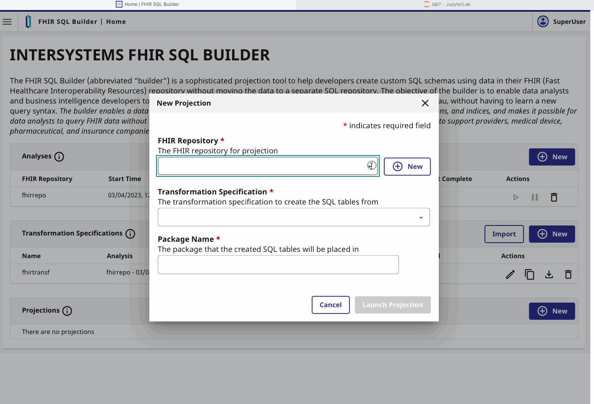

# 🏥 Workshop: Intro to Healthcare Interoperability

[](./LICENSE) [](https://www.docker.com/) [](https://code.visualstudio.com/) [](#) [](https://www.intersystems.com/iris)

Welcome to this hands-on workshop designed to help you explore **InterSystems IRIS for Health** and its powerful **Interoperability Framework** through real-world healthcare integration scenarios.

🔗 For extended learning, check out [InterSystems Learning](https://learning.intersystems.com).  
🖼️ Interested in imaging workflows? Visit our [DICOM Interop Workshop](https://github.com/intersystems-ib/workshop-iris-dicom-interop).

---

## 🧰 Requirements

Before you begin, make sure you have the following tools installed:

- [Git](https://git-scm.com/downloads)  
- [Docker & Docker Compose](https://docs.docker.com/compose/install/)  - ⚠️ On **Windows**, Docker must be set to use **Linux containers**  
- [Visual Studio Code](https://code.visualstudio.com/download) with the [InterSystems ObjectScript Extension Pack](https://marketplace.visualstudio.com/items?itemName=intersystems-community.objectscript-pack)

---

## 🚀 Getting Started

Clone this repo and spin up the environment with Docker Compose:

```bash
git clone https://github.com/intersystems-ib/workshop-healthcare-interop
cd workshop-healthcare-interop
docker compose build
docker compose up -d
```

Open the `workshop-healthcare-interop` folder in **VS Code** to explore the source.

---

## 💡 Scenario 1: HIS Orders & Lab Results

### 🧾 Step 1: HIS Sends Order to LAB



>A Hospital Information System (HIS) sends a REST request to IRIS → IRIS validates the test code via an external SQL catalog → IRIS transforms the message into HL7 (ORM^O01) → Sends it to the Laboratory.

#### 🔍 Explore the Production

- Open the [Management Portal](http://localhost:52773/csp/sys/UtilHome.csp)  
- Login with: `superuser` / `SYS`
- Go to [Demo.OrderProduction](http://localhost:52773/csp/healthshare/interop/EnsPortal.ProductionConfig.zen?PRODUCTION=Demo.OrderProduction)

Explore:
- Components: Business Services, Processes, Operations
- Visual trace & connector lines
- Component settings and data flow

#### 🧪 Test the LAB Catalog Lookup

- Select the `LAB Catalog SQL` component. This is the component that runs a SQL query in an external DB to validate a test code.
- Use *Actions > Test* with message type: `Demo.LAB.Msg.CheckTestCatalogReq`
- Try codes like `GLU` or `CBC` and check the results

If you are interested in having a look at the the catalog DB directly:

```bash
docker exec -it mysql bash
mysql --host=localhost --user=testuser testdb -p  # Password: testpassword
```

```sql
SELECT * FROM TestCatalog;
```

#### 📤 Send an Order from HIS

Use Postman ([collection](workshop-healthcare-interop.postman_collection.json) provided) or `curl` to create a new order from HIS:

```bash
curl -X POST http://localhost:52773/his/api/order \
  -H "Content-Type: application/json" \
  -d '{
  "msgId": "DDJ-20250408-001",
  "orderId": "ORD-20250408-001",
  "patient": {
    "mrn": "PAT-12345",
    "name": "Juan Perez",
    "birthDate": "1980-05-15",
    "gender": "male"
  },
  "practitioner": {
    "identifier": "DR-98765",
    "name": "Dr. Maria Gomez"
  },
  "orderDateTime": "2025-04-08T10:30:00Z",
  "test": {
      "code": "GLU",
      "description": "Blood glucose test",
      "priority": "routine"
   },
  "clinicalInfo": "Patient with dizziness and history of diabetes."
}'
```

Then:
- Open the [Message Viewer](http://localhost:52773/csp/healthshare/interop/EnsPortal.MessageViewer.zen)
- Inspect traces and data flow

#### ⚙️ Inspect the BPL Process & Data Transformations

- Click on `HIS Order Process` > magnifier icon next to *Class name*
- Inspect the **BPL** (Business Process Language) graphical flow



- Check *Transform* actions > Open **DTL Editor**


---

### 📥 Step 2: LAB Sends Back Results



>The Laboratory sends the results back to IRIS using HL7 → IRIS processes the results and transforms the HL7 to a SOAP request that can be processed by the Hospital Information System (HIS) → Sends it to the Hospital.


#### 🔁 Simulate ORU^R01 Messages

- Copy `test/ORUR01_*` files into `test/in` directory
- Monitor message flow in [Message Viewer](http://localhost:52773/csp/healthshare/interop/EnsPortal.MessageViewer.zen)

#### 🧠 Understand HL7 Routing

- Open `LAB HL7 Router In`
- Check routing rules by clicking the magnifier next to *Business Rule Name*



---

## 📦 Scenario 2: FHIR Repository

Let’s persist and interact with FHIR resources via InterSystems IRIS for Health.

### 🏗️ Create a FHIR Server

In **Health > FHIRREPO > FHIR Configuration > Server Configuration**, define:

- Namespace: `FHIRREPO`
- Name: `fhirrepo`
- URL: `/csp/healthshare/fhirrepo/fhir/r4`
- Version: `FHIR R4`



### 📥 Load FHIR Data

In [WebTerminal](http://localhost:52773/terminal/):

```objectscript
zn "FHIRREPO"
set sc = ##class(HS.FHIRServer.Tools.DataLoader).SubmitResourceFiles("/app/install/simple-fhir-data/", "FHIRServer", "/csp/healthshare/fhirrepo/fhir/r4")
```



### 🔗 Interact via API

Use Postman ([collection](./workshop-healthcare-interop.postman_collection.json) included): 


or run this ObjectScript snippet to leverage pre-built clients:

```objectscript
set clientObj = ##class(HS.FHIRServer.RestClient.FHIRService).CreateInstance("/csp/healthshare/fhirrepo/fhir/r4")
do clientObj.SetResponseFormat("JSON")
set response = clientObj.Read("GET", "Patient", "10")
zwrite response.Json
```

---

## 🔄 FHIR Interoperability

You can also route FHIR requests through IRIS’ Interoperability engine and leverage all the framework power:

1. Go to [FHIR Server Management](http://localhost:52773/csp/fhir-management/index.html#/home)
2. Edit your server → In *FHIR Server Service Configuration*:
Set `InteropService` as your Service Config Name

Now, incoming FHIR requests will go through [fhirdemo.Production](http://localhost:52773/csp/healthshare/fhirrepo/EnsPortal.ProductionConfig.zen?PRODUCTION=fhirdemo.Production)

You can inspect all transactions in the [Message Viewer](http://localhost:52773/csp/healthshare/fhirrepo/EnsPortal.MessageViewer.zen).

---

## 📊 FHIR Analytics with FHIR SQL Builder

FHIR data is graph-based, but with **FHIR SQL Builder**, you can query it via SQL — no data duplication needed!

### Step 1: 🔍 Analyze Repository

- Open [FHIR SQL Builder UI](http://localhost:52773/csp/fhirsql/index.html#/)
- Create New Analysis:
  - Repository: `fhirrepo`, host: `localhost`, port: `52773`
  - Credentials: `superuser` / `SYS`
  - Endpoint: `/csp/healthshare/fhirrepo/fhir/r4`

### Step 2: 📐 Define SQL Projection

- Create a **Transformation Spec**
- Add paths like:
  - `Patient.gender`
  - `Observation.code.coding.code`
  - `Observation.valueQuantity.value`



Or import `install/fhirtransf.json`.

### Step 3: 📤 Project to SQL

Define a package (e.g. `demo`) for your SQL projection.

Test it using the provided [Jupyter Notebook](http://localhost:8888/lab/tree/IRISPython.ipynb)!



---

## 🙌 You're Ready!

Explore, break things, build your own flows — and don’t forget to have fun learning how **InterSystems IRIS for Health** helps solve real-world interoperability challenges!
