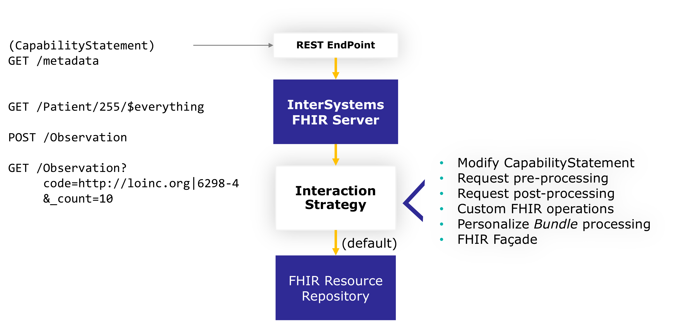
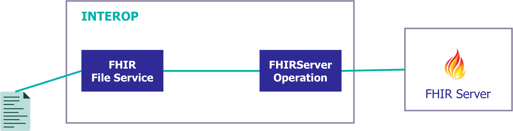
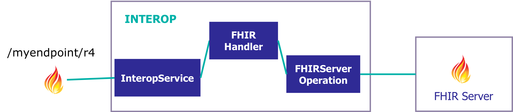

# Intro to Healthcare Interoperability
Examples you can use to learn the main ideas involved in HealthCare Interoperability using InterSystems IRIS for Health. 

You can find more in-depth information in https://learning.intersystems.com.

# What do you need to install? 
* [Git](https://git-scm.com/downloads) 
* [Docker](https://www.docker.com/products/docker-desktop) (if you are using Windows, make sure you set your Docker installation to use "Linux containers").
* [Docker Compose](https://docs.docker.com/compose/install/)
* [Visual Studio Code](https://code.visualstudio.com/download) + [InterSystems ObjectScript VSCode Extension](https://marketplace.visualstudio.com/items?itemName=daimor.vscode-objectscript)

# Setup
Build the image we will use during the workshop:

```console
git clone https://github.com/intersystems-ib/workshop-healthcare-interop
cd workshop-healthcare-interop
docker-compose build
```

* Run the containers we will use in the workshop:
```
docker-compose up
```

Open `workshop-healthcare-interop` folder in VS Code.

# Basics 

## Start FindRateProduction

* Open the [Management Portal](http://localhost:52773/csp/sys/UtilHome.csp).
* Login using the default `superuser`/ `SYS` account.
* *Interoperability > Namespace USER > List > Productions > Demo.Loan.FindRateProduction > Open*
* Start Production
* Have a look at the Business Services, Business Processes and Business Operations.
* Click on the *connector* (green ball) to see how the components are linked.
* See the *Legend* to understand the meaning of the different colors of the components.

## Test a Business Operation
* Click on `Demo.Loan.WebOperations`
* Go to *Actions* tab > Test > Choose a `Demo.Loan.CreditRatingRequest` message.
* Enter some input and see the output in the resulting Visual Trace.
* Have a look at the involved Business Operation and Messages in VS Code.

## Make a sample loan request
* Open http://localhost:52773/csp/healthshare/interop/DemoLoanForm.csp and enter some data (you can test with different values).
* Go back to your production and open the [Message Viewer](http://localhost:52773/csp/healthshare/interop/EnsPortal.MessageViewer.zen).
* Have a look at the messages, go through some of the traces.
* Pay attention to the elements involved, sync/async calls, message contents and possible errors or alerts thrown.

## Inspect a Business Process
* Back in [Demo.Loan.FindRateProduction Production](http://localhost:52773/csp/healthshare/interop/EnsPortal.ProductionConfig.zen?PRODUCTION=Demo.Loan.FindRateProduction), click on `Demo.Loan.FindRateDecisionProcessBPL`.
* On the settings tab, click on the magnifyer icon on the *Class name* setting.
* Inspect the graphical BPL definition of the process.
* When you are done, stop the production.

## Start Demo.HL7.MsgRouter.Production
* *Interoperability > Namespace USER > List > Productions > Demo.HL7.MsgRouter.Production > Open*
* Start production.
* Have a look at the production, notice the prebuilt HL7 Business Services and Operations that are being used.
* Explore the settings on those services and operations (e.g. FilePath, etc.)

## Process some sample HL7 messages
* In your VS Code with `workshop-healthcare-interop` opened, copy `test/*.txt` files into `test/in` subdirectory.
* Go back to the production and see [Message Viewer](http://localhost:52773/csp/healthshare/interop/EnsPortal.MessageViewer.zen).
* Explore some the new messages that have appeared. Notice the HL7 messages.

## Explore routing rules and data transforms
* Back in Demo.HL7.MsgRouter.Production Production configuration page, click on `XYZ_Router`.
* Click on the magnifying glass on *Business Rule Name* in the Settings Tab.
* Notice the different routing rules based on the content of the HL7 messages.
* Find some of the rules that are using a *Data Transform*.
* Double-click on the Data Transform element and open the *DTL Editor*.
* Have a look at how can messages be transformed.


# FHIR Repository



### Create FHIR endpoint
Create FHIR server in Health > FHIRREPO > FHIR Configuration > Server Configuration as:
* Endpoint: `/csp/healthshare/fhirrepo/fhir/r4`
* Core FHIR package: `hl7.fhir.r4.core@4.0.1`

### Load simple FHIR data
Load some simple sample FHIR data into repo.

```objectscript
zn "FHIRREPO"
set sc = ##class(HS.FHIRServer.Tools.DataLoader).SubmitResourceFiles("/app/install/simple-fhir-data/","FHIRServer","/csp/healthshare/fhirrepo/fhir/r4")
```

### Test FHIR repository
TODO


# FHIR Interoperability

## Scenario: FHIR client
Build a fhir client to send some requests to a FHIR server.



Have a look at the [interop.Production](http://localhost:52773/csp/healthshare/interop/EnsPortal.ProductionConfig.zen?PRODUCTION=interop.Production) production:
* `interop.bs.FHIRFileService` - Business Service that reads a file and creates a `HS.FHIRServer.Interop.Request` message.
* `interop.bp.FileToFHIRService` - Business Process that prepare `HS.FHIRServer.Interop.Request` from service before sending to external FHIR server.
* `HS.FHIRServer.Interop.HTTPOperation` - built-in Business Operation that sends a FHIR request to an external FHIR server.

Run some tests:
* Start the production
* Copy `data/patient.json` into `data/fhir-input` to process a sample file in your production.


## Scenario: FHIR request processing



In this scenario you need to receive FHIR requests in an interoperability production, maybe manipulate them and finally send that requests to a FHIR server.

In case you need to forward a FHIR request to an external server you can use simple FHIR Interoperability Adapter in InterSystems IRIS or HealthShare Health Connect.

You can find more information in [FHIR Interoperability Adapter](https://docs.intersystems.com/healthconnect20221/csp/docbook/DocBook.UI.Page.cls?KEY=HXFHIR_fhir_adapter).

### Install adapter
You need to install the FHIR interoperability adapter before using it in a namespace.
During the adapter installation it will create:
* A web application for your FHIR server endpoint.
* An `InteropService` and `InteropOperation` in your production.

Install the adapter:

```
zn "INTEROP"
set status = ##class(HS.FHIRServer.Installer).InteropAdapterConfig("/myendpoint/r4")
```

TODO Test

Test your service using [iris-fhir-interop.postman_collection.json](./iris-fhir-interop.postman_collection.json) Postman collection *FHIR Interop (OAuth)*


### FHIR SQL Builder

http://localhost:52773/csp/fhirsql/index.csp